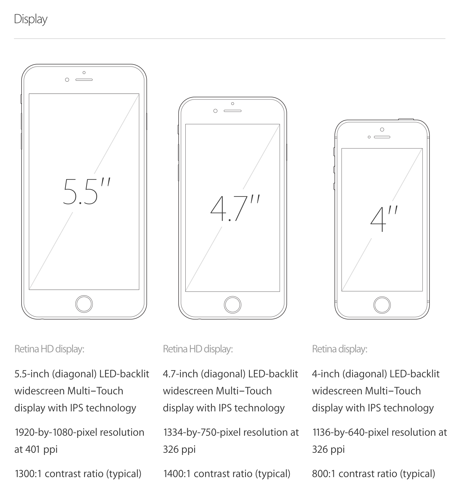
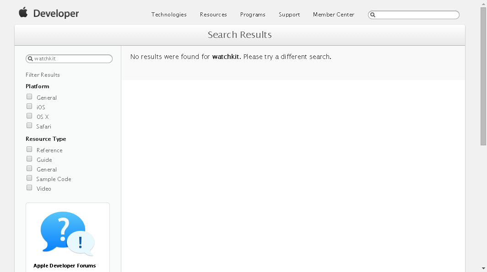
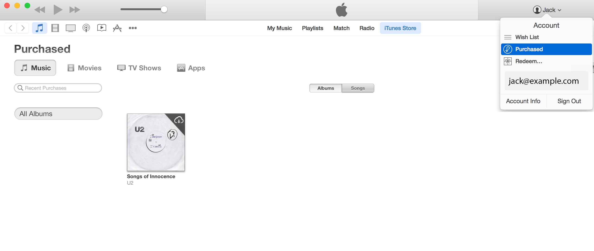

# [FIT] Melbourne Cocoaheads #76
#### 11 September 2014
#### @JackBarker

---

# [FIT] The month that was

^ August 15 - September 11 2014
^ Presented by Jack Barker jack.barker.au@gmail.com

---

# [FIT] tmtw; tldr

---

# tldr;
- August 31: Brute Force / Phising attack on icloud
- September 9 announcements:
 - iPhone 6/6+
 - Apple Watch
 - Apple Pay
- U2 album giveaway
- Macworld downsizing

---

# [fit] 9.9.2014

---

# [fit] Live Stream Event
- "Wish we coud say more."
- Slack ( melbournecocoa.slack.com )
- Live stream issues?

---

# [fit] New Devices

---

# [fit] iPhone 6 / 6+

Image credit: [TechCrunch][TechCrunch]

---

---

<!-- Apple Watch -->
# [fit] :green_apple: :watch:

---

#Our most personal device yet.

> Our goal has always been to make powerful technology more accessible. More relevant. And ultimately more personal. Apple Watch represents a new chapter in the relationship people have with technology. It’s the most personal product we’ve ever made, because it’s the first one designed to be worn.
-- Apple.com

---

#Features
- **3 Models**
 - **Apple Watch**
 - **Apple Watch Sport** (improved durability)
 - **Apple Watch Edition** (gold plated. literally.)
- **2 Sizes** (38mm / 44mm)

---

#Features (cont')

- Requires iPhone
- From $349 (USD)
- "Early 2015"
- Fitness / Siri / Apple Pay / Apple TV / Remote Camera

---

#WatchKit

---

---

#Criticisms

- iPhone **accessory**
- Price
- Battery Life?
> "..as more details emerge, it's becoming clear that the device's battery won't last much longer than one day." --[Mashable][BatteryLife]
- Smartwatches: Niche / Mainstream?
- What if you're a lefty?
- Where is the Killer App?

---

# [fit] New UX Paradigms

---

## UX: Apple Watch
- Tiny screen
- Tap vs. Press
- Crown
- Keyboard alternatives (i.e. Voice / Quick responses)
- "Onboard" sensors (accelerometer, pulse detection)
- iPhone sensors (GPS &  wifi) via 802.11b/g and Bluetooth 4.0

---

## UX: iPhone6 Plus
- "One-handed" controls
- Expanded keyboard (copy/paste...etc)

---

# [fit] Apple Pay

---

## Apple Pay: Initial thoughts
- A bit like PayPass, using your iPhone (or Apple Watch)
- Begins in US, October 2014 (MasterCard, Visa, Amex)
- Pin / fingerprint
- Described as being "more secure" than a credit card... or not:
 - [http://www.gizmodo.com.au/2014/09/how-safe-can-apple-pay-really-be/]
- App integration

---

## Apple Pay: How big is this?
- End to paper money?
- How much longer do I need to carry a physical wallet for?
- How does this affect the cross-platform economy?

---

# [fit] U2 Album Launch

---

- 13th album: **Songs of Innocence**
- **Free to download** (next 5 weeks)
- Universal and U2 were paid
 - An undisclosed lump sum, for the exclusive window to distribute the album
 - Source: [Wall Street Journal](WSJ)

> "We were paid.
> I don't believe in free music. Music is a sacrament."
-- Bono ( Source: [Time.com][Time] )

---

---

# [fit] Macworld
> "After 30 years, Macworld is no longer a Magazine" --[FastCompany][FastCompany]

---

### Jason Snell:
> " To their great credit, they allowed us to end our relationship amicably. I thank them for their support and their generosity. They even asked me to write a final front-of-the-book column in the November issue of Macworld.
> Unfortunately, many of my colleagues lost their jobs today. If there's anything I can do to help them, I will. I have had time to plan for this day, but they haven't. You probably know some of them. Please join with me in giving them sympathy and support." --[Jason Snell][SnellWorld]

---

### John Gruber:
> "Re-reading Snell's announcement, I have to say, it's a masterpiece of tone and restraint." --[John Gruber][DaringFirball]

---

# Key Dates

- Sep 12: Preorder date for iPhone 6 / 6+
- Sep 17: iOS 8
- Sep 19: "Ship date" for iPhone 6 / 6+ (inc. Aust)
- XXX XX: Xcode 6 to leave beta
- Oct: Apple Pay launch date (US)
- Oct 13: U2 album's general release (giveaway ends)
- Early 2015: Apple Watch becomes available

---

# [fit] </tmtw>

---

# References
<!-- Markdown style reference -->
[1]: http://www.melbournecocoaheads.com/ "stuff"
[2]: http://www.melbournecocoaheads.com/about/ "other stuff"
[BatteryLife]: http://mashable.com/2014/09/10/apple-watch-battery-life/
[FastCompany]:http://www.fastcompany.com/3035564/after-30-years-macworld-is-no-longer-a-magazine
[SnellWorld]:http://snellworld.com/
[DaringFirball]:http://daringfireball.net/
[Time]:http://time.com/3313164/bono-u2-apple-itunes/
[WSJ]:http://blogs.wsj.com/speakeasy/2014/09/09/u2-apple-and-the-deal-behind-getting-songs-of-innocence-free-of-charge/
[TechCrunch]:http://techcrunch.com/2014/09/09/hands-on-with-the-iphone-6-and-the-iphone-6-plus/

<!-- Appears Markdown style references are unsupported by Deckset at this time -->
- Apple.com
- TechCrunch (techcrunch.com/2014/09/09/hands-on-with-the-iphone-6-and-the-iphone-6-plus/)
- Mashable.com/2014/09/10/apple-watch-battery-life
- Fastcompany.com/3035564/after-30-years-macworld-is-no-longer-a-magazine
- Snellworld.com

---

- Daringfireball.net
- time.com/3313164/bono-u2-apple-itunes
- blogs.wsj.com/speakeasy/2014/09/09/u2-apple-and-the-deal-behind-getting-songs-of-innocence-free-of-charge
