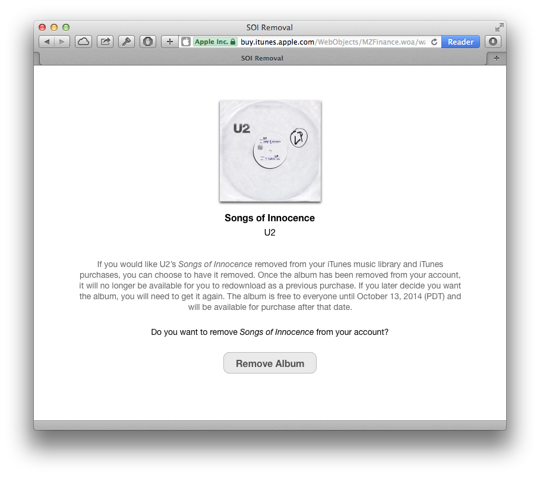
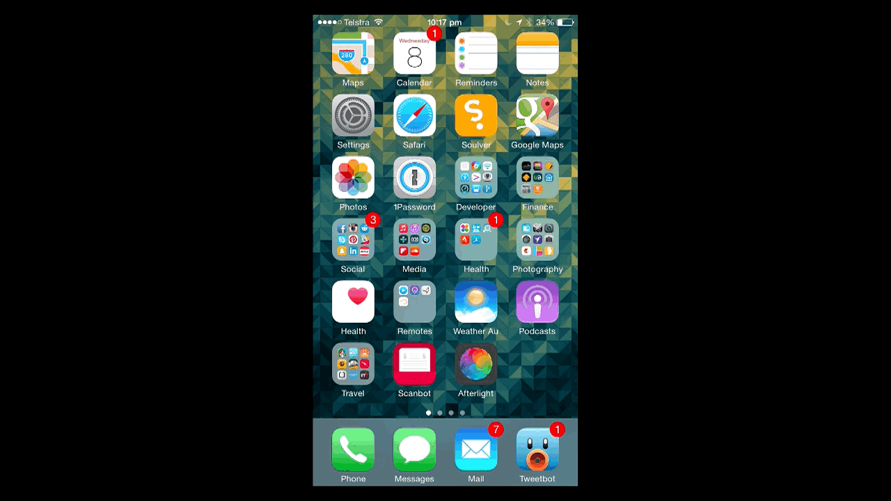
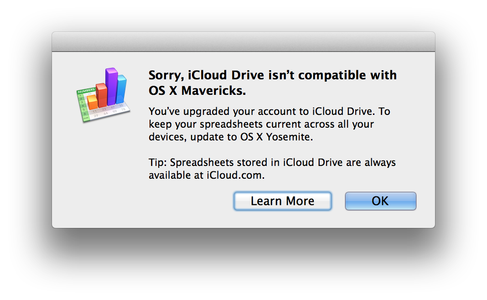
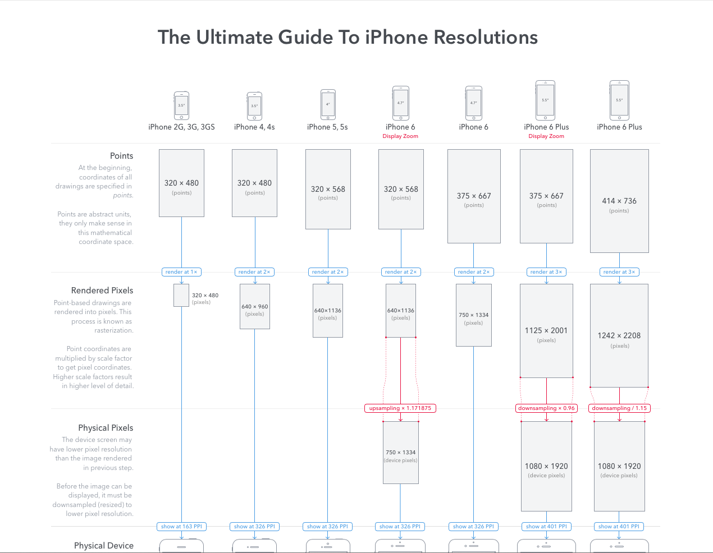

# [FIT] Melbourne Cocoaheads # 77
# [FIT] October 9, 2014

^ Link from Sean: http://www.forbes.com/sites/markrogowsky/2014/09/26/a-tale-of-two-apples/

---

# The month that was (TMTW)
### September 12 - October 14 2014

^ Presented by Jesse Collis jesse@jcmultimedia.com.au

---

# [FIT] tmtw; tldr;

---

# tmtw; tldr;

- iPhone 6
- iOS 8, 8.0.1, 8.0.2
- #BendGate

---

^ Sept 9

---

---

# 7 days later...

^ 16 September 16th

---

^ iOS 8

---

---

---

---

---

## iPhone Day

^ September 19

---

.m4v)

^ Kid drops iPhone at launch

---

# [Fit] ten

---

# [fit] Million

---

# [FIT] Phones

---

---

[^1]: https://www.youtube.com/watch?v=MuOvqeABHvQ

---

^ If you weren't confused enough, PixelCut have a good guide.

[^1]: http://www.paintcodeapp.com/news/ultimate-guide-to-iphone-resolutions

---

# [FIT] #ShellShock

^ http://9to5mac.com/2014/09/25/mac-vulnerability/
^ 25 Sept

---

# 8.0.1 Fail

^ http://www.macrumors.com/2014/09/24/ios-8-0-1-issues-possible-fix/
^ http://www.cnet.com/au/news/apple-releases-ios-8-0-1-a-week-after-ios-8-launch/
^ ~ 26th

---

# 8.0.2 Update

---

# HealthKit Apps

^ http://9to5mac.com/2014/09/27/apps-for-health-section/

---

# iOS 8 crashes are up

^ https://www.yahoo.com/tech/study-ios-8-crashes-78-more-than-ios-7-98229761939.html

---

>As of midnight, September 24, Crittercism states that the iOS 8 crash rate ... lands at "64.5% higher than the current iOS 7 crash rate." 

^ http://readwrite.com/2014/09/23/ios-8-apple-iphone-crashes-wtf

---

# #BendGate

.m4v)

---

# Consumer Reports to the rescue

^ http://www.tuaw.com/2014/09/27/consumer-reports-bend-tests-show-the-iphone-6-plus-is-stronger-t/?ncid=rss_truncated&cps=gravity

---

>The iPhone 6 Plus, the more robust of the new iPhones in our testing, started to deform when we reached 40.823 kg of force, and came apart with 49.89 kg of force.

---

[^1]: http://www.engadget.com/2010/07/16/inside-apples-black-lab-wireless-testing-facilities/

---

--- 

# 2010

---

---

^ http://www.engadget.com/2010/07/16/live-from-apples-iphone-4-press-conference/

---

#  Watch @ Fashion Week

^ october 1
^ http://www.nytimes.com/2014/10/02/fashion/apple-watch-azzedine-alaia-paris-fashion-week.html?_r=0

---

# Jony Ive Profile in Vogue[^1]

[^1]: http://www.vogue.com/1415025/apple-design-genius-jonathan-ive

---

# OS X 10.10 Gold Master

^ October 5

---
# iOS 8 Adoption

^ https://mixpanel.com/trends
^ https://developer.apple.com/support/appstore

^ Slow iOS 8 uptake
^ http://9to5mac.com/2014/10/06/ios-8-lagging-adoption-iphone-6-uptake

---

> Last year the number for iOS 7 adoption was in the 70s in October, which was a faster adoption rate than iOS 6 the year prior.
-- John Gruber

^ http://www.macrumors.com/2014/10/06/ios-8-adoption-stagnates/

---

# Steve Jobs 1955-2011

>Steve’s vision extended far beyond the years he was alive, and the values on which he built Apple will always be with us. Many of the ideas and projects we’re working on today got started after he died, but his influence on them — and on all of us — is unmistakeable.
-- Tim Cook 

---

# iPad Rumors for the 16th 

---

# [fit] </TMTW>

