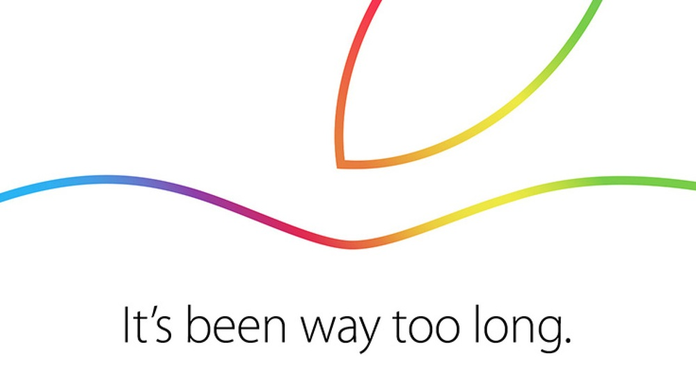
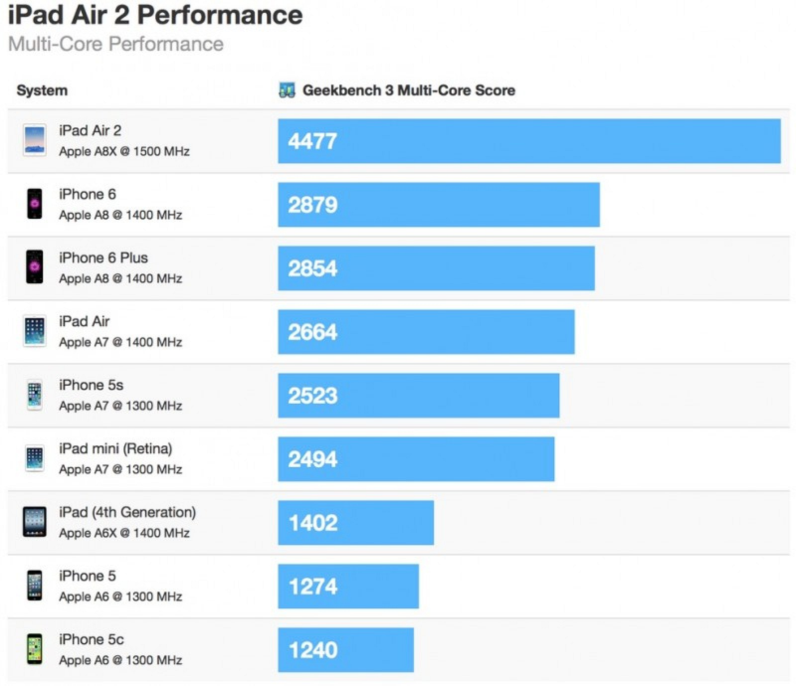
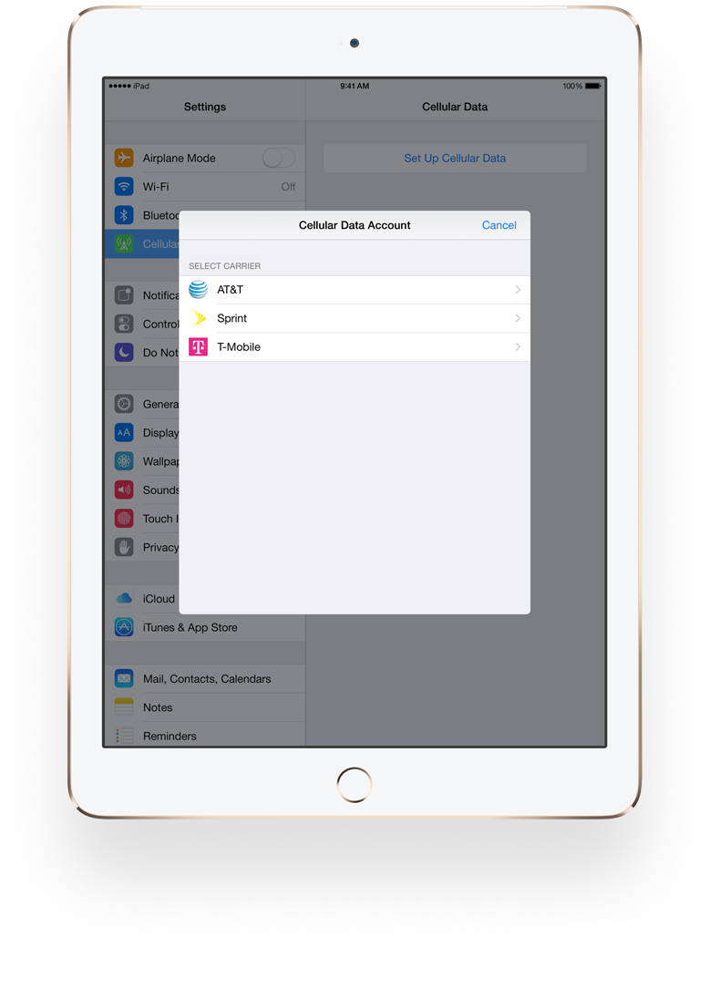
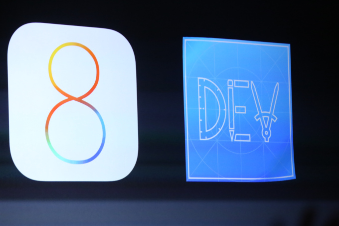
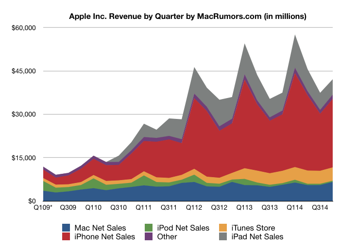
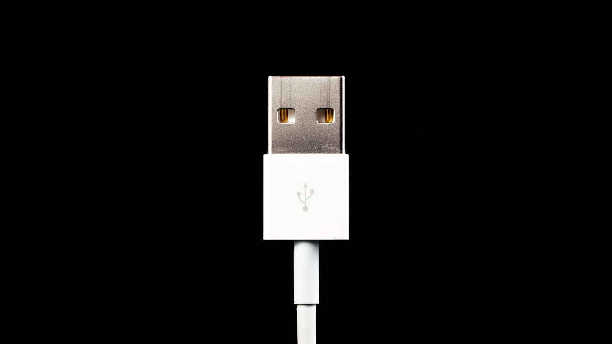
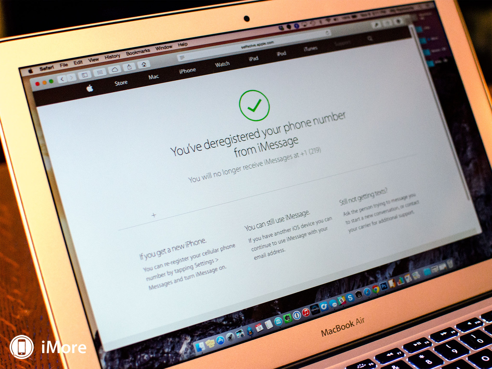
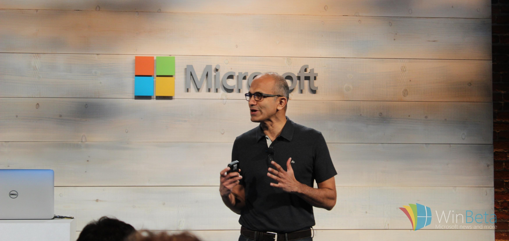

# [fit] TMTW

# [fit] @peterngoldsmith

---

# Reddit Acquires Alien Blue
October 15

http://techcrunch.com/2014/10/15/reddit-acquires-alien-blue-the-most-popular-unofficial-reddit-app/

---

# iPad Event
16 October 

- Watch Kit in "November"
- Watch due in "Spring" after Chinese New Year
- Fresh Mac Mini

---

#[fit] 5120
#x
#[fit] 2880

---

# iPad Air 2
# [fit] Fast
- 18% thinner, Gold, Touch ID.
- Geekbench saying it's 55% faster than other iOS devices

---

# iPad Mini 3

- Gold, Touch ID
- Still selling iPad Mini, iPad Mini 2
- A7

---

#[fit] Yosemite Released 

---

# Apple SIM

- Switch between carriers at a whim.
- AT&T confirms it locks iPad's new Apple SIM (October 24)

---

# A new Jony Ives Video

https://www.youtube.com/watch?v=ef69BUlge-A

---

#iPhone Launch in China, India, Monaco
October 17

http://9to5mac.com/2014/10/13/apple-rolls-out-iphone-6plus-to-36-more-countries-this-month/#more-346283

---

# iOS 8.1 & Apple Pay
20 October

---

# iOS 8 & 64Bits from February 2015
20 October
https://developer.apple.com/news/?id=10202014a

---

# Apple Q4 2014 Results
20 October
- Revenue: $42.123 billion, + 12.4%
- iPhone: 39.272 million, + 16.2%
- iPad: 12.316 million, - 12.5%
- Mac: 5.52 million, + 20.7%

---

# Testflight goes proper live
October 23

https://developer.apple.com/news/?id=10232014a

---

# Tim Cook WSJ Interview
October 27

- Apple Says 1 million Apple Pay activations in 72 hours
- iPod Classic was discontinued because they couldn't get the parts
- Video: http://online.wsj.com/articles/tim-cook-on-apple-watch-payments-and-getting-tv-right-full-video-1415660136

---

# Tim Cook Comes out publicly as gay
30 Oct - Business Insider

> At the same time, I believe deeply in the words of Dr. Martin Luther King, who said: “Life’s most persistent and urgent question is, ‘What     are you doing for others?’ ” I often challenge myself with that question, and I’ve come to realize that my desire for personal privacy has been holding me back from doing something more important. That’s what has led me to today.

http://www.businessweek.com/articles/2014-10-30/tim-cook-im-proud-to-be-gay

--- 

# Spotify Takes over royaltys in iTunes in the UK
November 5

http://9to5mac.com/2014/11/05/itunes-vs-spotify/

---

# Wire Lurker Malware
November 5

Mainly targeting Chinese, over the wire. Apple has already blocked it

http://www.imore.com/heres-why-most-us-dont-have-worry-about-wirelurker-malware

---

# Microsoft Office apps go Free
November 6

http://blogs.microsoft.com/blog/2014/11/06/office-everywhere/

---

# Lenovo S90 "Sisley" is an iPhone Rip off
November 5

http://www.phonearena.com/news/Lenovo-S90-Sisley-now-official-with-a-shameless-iPhone-like-presentation_id62502

---

# Deregister Your old number from iMessage
November 9

https://selfsolve.apple.com/deregister-imessage

---

# [fit]56% 
# [fit]Devices running iOS 8

---

#[fit] @Philae2014
#[fit] "Touchdown! My new address: 67P! #CometLanding"
November 12

---

# [fit]Microsoft takes .NET open source and cross-platform

