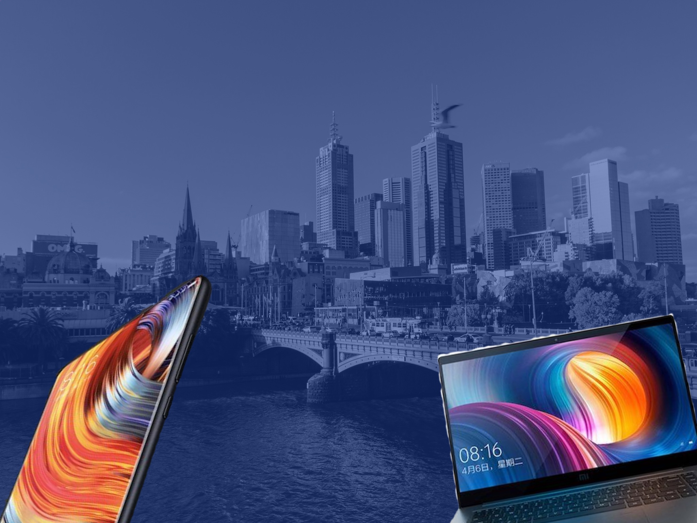

theme: Letters from Sweden, 1

# [fit] Melbourne Cocoaheads #109

---

# [fit] The Month That Was

---

# [fit] TMTW; TLDR

---

<!-- [.build-lists: true] -->

- macOS and iOS betas
- Emergency SOS
- AirPods shipping improves
- AccuWeather for iOS - $$$ 👀
- Apple wins Emmy for Siri on TV
- Apple Watch makes up ~49.6% of smartwatches last Q
- Siri leadership now in the hands of Hair Force One
- Apple ends iTunes Music Festival
- more betas...

---

# [fit] Products

---

---

# [fit]  Products

---

#[fit]  Watch

---

#[fit]  Watch

- Cellular (LTE)
- Siri can talk!
- watchOS 4 & the W2
- New bands
    - Hermés
    - Sport Loop

---

#[fit]  TV 4K

---

#[fit]  TV 4K

- HDR
- TV App in Australia!
- Gigabit Ethernet
- White circle around the Menu button
- 4K Movies
- ...they showed off a game! Woo.

---

#[fit] ~~ Phone~~

---

#[fit] iPhone 8

---

#[fit] iPhone 8

- True Tone Display
- Portrait Lighting
- A11 Bionic
- Apple-designed GPU
- Glass-back design + Qi

---

#[fit] iPhone X

---

#[fit] iPhone X

#[fit] "Pretty much the same as the other one."

---

#[fit] iPhone X

- Super Retina Display
- OLED Display w/ True Tone
- Face ID
- Portrait - Front _and_ back
- Animoji
- Dual OIS

---

# iPhone 8,  TV 4K,  Watch
Preorder: September 15th at 5:01pm
Release: September 22nd

---

# iPhone 8,  TV 4K,  Watch
Preorder: September 15th at 5:01pm
Release: September 22nd

#[fit] iPhone X
Preorder: October 27th at 6:01pm
Release: November 3rd

---

---

#[fit] https://developer.apple.com/videos/play/fall2017

- developer.apple.com/
- videos/
- play/
- fall2017

---

#[fit] https://developer.apple.com/videos/play/fall2017

---

# [fit] TMTW
