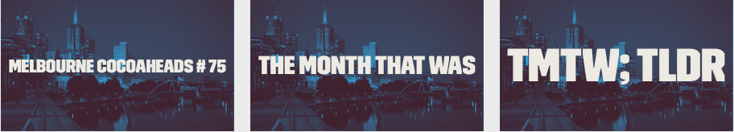

# The Month That Was (TMTW)

A monthly short talk and/or rant for [Melbourne Cocoaheads](http://www.melbournecocoaheads.com/) that covers the news since last meetup.

Topics can include: 

- Apple news
- Mobile / IOT news
- Local Melbourne News
- Occurances or speculation based on events in the past month

The idea is to present a fast paced, relaxed and interactive presentation to break the ice at Cocoaheads meetups. 

# Contributing

The presentations so far have been done in markdown and presented with [Deckset](http://decksetapp.com/). If you'd like to present a TMTW talk at a meetup get in touch with Jesse at jesse@jcmultimedia.com.au.

# Open Source

TMTW talks should be added to this repository each month, in both [Markdown](http://daringfireball.net/projects/markdown/basics) and PDF format (for history sake). 
